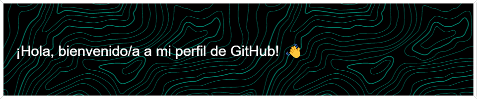

## Sobre mí 🧑‍💻
¡Hola! Soy Jairo, un apasionado estudiante de desarrollo web. Me encanta explorar el vasto mundo de la tecnología y aprender nuevas habilidades para crear experiencias web impresionantes. Siempre estoy emocionado por los desafíos y me gusta trabajar en proyectos interesantes que me permitan ampliar mis conocimientos y habilidades.

## Habilidades técnicas 🚀
- 💻 **Desarrollo web**: HTML5, CSS3, JavaScript
<!--🌐 **Frameworks**: React, Vue.js-->
- 📚 **Gestión de versiones**: Git, GitHub
<!--🗃️ **Bases de datos**: MySQL, MongoDB-->
- 🎨 **Herramientas de diseño**: Adobe Illustrator, Figma
<!--
## Proyectos destacados ✨
- 🚀 **[Proyecto 1](enlace al proyecto)**: Un sitio web interactivo utilizando React, que permite a los usuarios buscar y filtrar una amplia gama de productos.
- 🌟 **[Proyecto 2](enlace al proyecto)**: Una aplicación web basada en Vue.js que proporciona una plataforma para que los usuarios compartan sus recetas favoritas y se conecten con otros entusiastas de la cocina.
- ✍️ **[Proyecto 3](enlace al proyecto)**: Un blog personalizado desarrollado desde cero utilizando HTML, CSS y JavaScript, donde comparto mis experiencias y conocimientos sobre desarrollo web.
-->
## Educación 🎓
Actualmente, estoy estudiando desarrollo web en Alura Latam. A través de mi educación formal y proyectos personales, he adquirido una sólida comprensión de los conceptos fundamentales y las mejores prácticas en el desarrollo web.
<!--
## Colaboración y contribuciones 🤝
Me encanta colaborar con otros desarrolladores y aprender de su experiencia. Estoy abierto a oportunidades de colaboración en proyectos interesantes relacionados con el desarrollo web. Además, me gusta contribuir a proyectos de código abierto para ayudar a la comunidad de desarrollo.
-->
<!--
## Contacto 📞
Si estás interesado/a en colaborar en un proyecto emocionante o simplemente quieres charlar sobre desarrollo web, no dudes en contactarme a través de los siguientes medios:

- 📧 Correo electrónico: [tu correo electrónico]
- 💼 LinkedIn: [enlace a tu perfil de LinkedIn]
- 🐦 Twitter: [tu nombre de usuario de Twitter]
-->
¡Espero tener la oportunidad de conectar contigo y trabajar juntos en el apasionante mundo del desarrollo web! 😊
